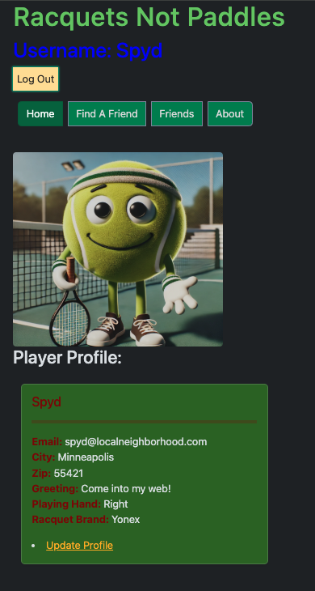
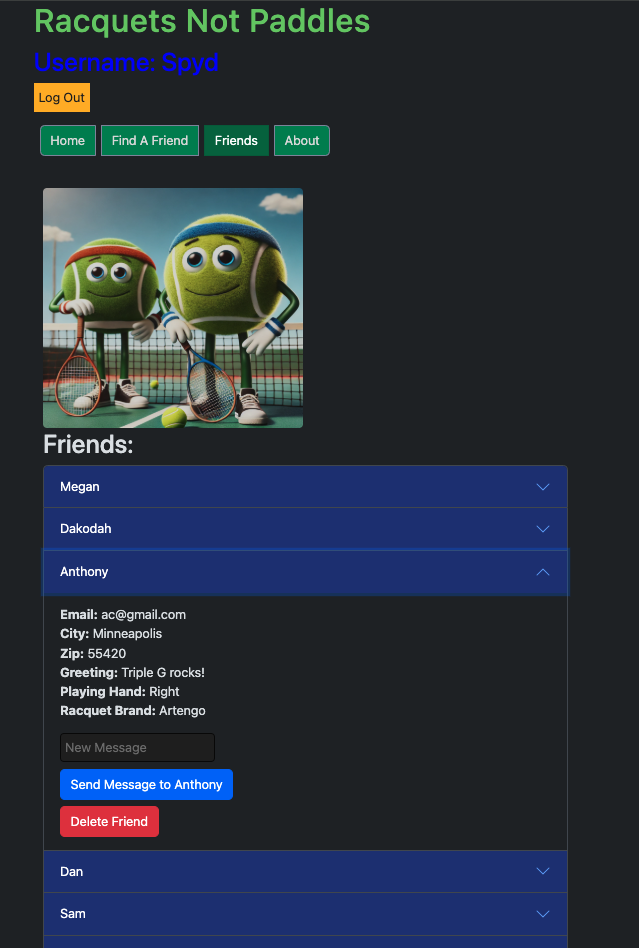

# Racquets Not Paddles

## Solo Capstone Project

Racquets Not Paddles is a full-stack web application designed to connect tennis players in their communities. In an era where pickleball is rapidly taking over public courts, this app brings focus back to tennis by helping players find each other, connect, message, and set up games.

## Prerequisites
Node.js

PostgreSQL

A SQL client like Postico (optional but helpful)

## Installation

How do you get your application up and running? This is a step by step list for how another developer could get this project up and running. The good target audience in terms of knowledge, would be a fellow Primer from another cohort being able to spin up this project. Note that you do not need a paragraph here to intro Installation. It should be step-by-step.

1. Create a database named `racquets_paddles`,
2. The queries in the `database.sql` file are set up to create all the necessary tables and populate the needed data to allow the application to run correctly. The project is built on [Postgres](https://www.postgresql.org/download/), so you will need to make sure to have that installed. We recommend using Postico to run those queries as that was used to create the queries, 
3. Open up your editor of choice and run an `npm install`
4. Run `npm run server` in your terminal
5. Run `npm run client` in your terminal

## Usage
You're a tennis player looking for someone to rally with this weekend. You log into Racquets Not Paddles, check your profile, browse potential partners, send a few direct messages, and boom — you've got a match set up!.

1. Log in or register
2. View and edit your profile
3. Browse other players
4. Add friends
5. Send and recieve messages
6. Set up matches and get out on the court!

## Documentation

[Scope](https://docs.google.com/document/d/14OXXLK6ynoyXLtJL7C6ETs2jPfKEGYVvPDdTovjT-Ds/edit?pli=1&tab=t.0)

## Built With

Front-End: React, React Router, Zustand, Bootstrap

Back-End: Node.js, Express.js

Database: PostgreSQL

Other Tools: Axios, Postico (recommended for DB management)

## Acknowledgement
Thanks to all my instructors at [Prime Digital Academy](www.primeacademy.io), and thanks to [Anthony Clarke](https://github.com/AntPrime), [Brian Larson](https://github.com/brianlarson), [Dakodah Spurlin](https://github.com/Koda125) who helped make this application a reality!

## Support
If you have suggestions or issues, please email me at [greggtrunnell@gmail.com](www.google.com)